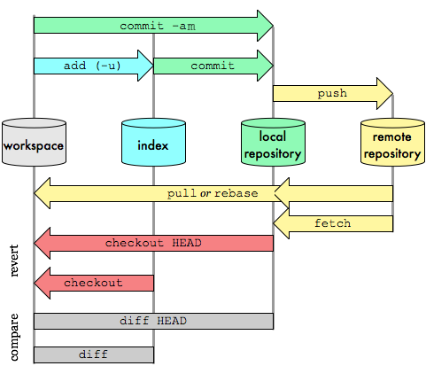
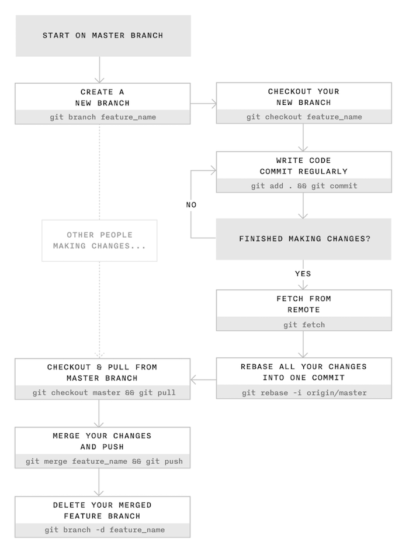

# Taller d'introducció a `git` i GitHub

En aquest taller d'introducció a `git` i [GitHub][1] aprendrem els comandaments bàsics per començar a treballar amb repositoris de forma local i remota.

1. [`git`](#git)  
       1.1 [Instal·lació i configuració de `git`](#instal·lació-i-configuració-de-git)  
       1.2 [Seccions principals d'un repositori `git`](#seccions-principals-dun-repositori-git)  
       1.3 [Estats d'un fitxer en `git`](#estats-dun-fitxer-en-git)  
       1.4 [Com treballar amb un repositori local](#com-treballar-amb-un-repositori-local)  
       1.5 [Com desfer canvis](#com-desfer-canvis)  
       1.6 [Esborrant i movent/renombrant fitxers](#esborrant-i-moventrenombrant-fitxers)  
       1.7 [Com treballar amb un repositori remot](#com-treballar-amb-un-repositori-remot)  
       1.8 [Branches](#branches)  
       1.9 [Com treballar en equip amb `git`](#com-treballar-en-equip-amb-git)  
       1.10 [El fitxer `.gitignore`](#el-fitxer-gitignore)  
       1.11 [Consultar l'historial de *commits*](#consultar-lhistorial-de-commits)  
2. [GitHub](#github)  
       2.1 [Creació d'un nou usuari](#creació-dun-nou-usuari)  
       2.2 [Configuració de GitHub](#configuració-de-github)  
       2.3 [*Pull Requests* a GitHub](#pull-requests-a-github)  
       2.4 [*Issues* a GitHub](#issues-a-github)  

# `git`

## Instal·lació i configuració de `git`

### Instal·lació de `git`

#### Ubuntu

```
sudo apt-get update
sudo apt-get install git
```

#### Windows

Descarregar des de la web oficial: http://git-scm.com/downloads.

### Configuració de `git`

Configurem el nom i el correu electrònic que apareixeran als *commits* que fem sobre els repositoris.

```
git config --global user.name "Nom"
```

```
git config --global user.email "correu@electronic.com"
```

Per comprovar si s'han aplicat els canvis podem executar el següent comandament per mostrar quina és la configuració actual de `git`:

```
git config --list
```

## Seccions principals d'un repositori `git`

En un repositori `git` podem diferenciar les següents seccions:

* *Workspace*
* *Staging area (Index)*
* *Local repository*
* *Remote repository*



Figura 1: Imatge d'[Oliver Steele](http://osteele.com).

## Estats d'un fitxer en `git`

Un fitxer pot estar en algun dels següents estats:

* Sense seguiment (*untracked*)
* Preparat (*staged*)
* Modificat (*modified*)
* Confirmat (*commited*)

El següent diagrama mostra en quina secció es pot trobar cada fitxer en funció del seu estat.

```
+-------------+  +-------------+  +-------------+
|  Workspace  |  |   Staging   |  |    Local    |
|             |  |     Area    |  |  Repository |
+------+------+  +------+------+  +------+------+
       |                |                |
       |                |                |
   Untracked            |                |
       |                |                |
   Modified          Staged          Commited
       |                |                |
       |                |                |
       |                |                |
       +                +                +
```
Per consultar l'estat dels fitxers fem servir el comandament:

```
git status
```

**Aquest comandament és molt utilitzat** ja que és fonamental conèixer l'estat dels fitxers del nostre repositori.

## Com treballar amb un repositori local

### Creació d'un repositori local

Un repositori Git és un directori ocult anomenat `.git` que es guarda al directori arrel del nostre projecte. El directori `.git` emmagatzema l'historial de tots els canvis que s'han realitzat.

El comandament per crear un repositori `git` és el següent:

```
git init
```

Per exemple, per crear el nostre primer repositori podríem fer el següent:

```
mkdir taller-git
cd taller-git
git init
```

Si examinem el contingut del directori `.git` veurem el següent arbre de continguts:

```
.
└── .git
    ├── HEAD
    ├── config
    ├── description
    ├── hooks
    │   ├── applypatch-msg.sample
    │   ├── commit-msg.sample
    │   ├── post-update.sample
    │   ├── pre-applypatch.sample
    │   ├── pre-commit.sample
    │   ├── pre-push.sample
    │   ├── pre-rebase.sample
    │   ├── pre-receive.sample
    │   ├── prepare-commit-msg.sample
    │   └── update.sample
    ├── info
    │   └── exclude
    ├── objects
    │   ├── info
    │   └── pack
    └── refs
        ├── heads
        └── tags
```

### Comandaments bàsics per treballar amb un repositori local

**Pas 1**

En primer lloc comprovarem en quin estat es troben els fitxers del repositori:

```
git status
```

**Pas 2**

Si tenim fitxers en estat ***untracked*** o ***modified*** els afegim a la ***staging area*** amb el següent comandament:

```
git add <nom_fitxer>
```

El comandament anterior ens permet seleccionar quins són els fitxers que volem moure a la ***staging area***. Si tenim diversos fitxers que volem moure a la ***staging area*** no és necessari fer-ho un a un, podem utilitzar el següent comandament per moure'ls tots alhora:

```
git add -A
```

**Pas 3**

Un cop tenim els fitxers a la ***staging area*** hem de fer un ***commit*** per moure'ls al repositori:

```
git commit -m "Breu comentari amb els canvis realitzats"
```

## Com desfer canvis

### Modificar el text de l'últim *commit*

```
git commit -m "Modifico el text de l'últim commit" --amend
```

### Afegir fitxers a l'últim *commit*

```
git commit --amend
```

**Exemple:**

Suposem que acabem de fer un *commit* al repositori però ens hem oblidat d'afegir un fitxer que volem incloure en aquest *commit*. En aquests casos podem utilitzar el comandament `git commit --amend` per afegir nous fitxers a l'últim *commit* realitzat sobre el repositori.

A continuació es mostra una possible seqüència de comandaments simulant la situació que acabem de descriure.

```
git add fitxer.txt
git commit -m "Afegim el fitxer.txt"
git add fitxer_oblidat.txt
git commit --amend
```

### Moure un fitxer de la *staging area* al *workspace*

```
git reset HEAD <fitxer>
```

**Exemple:**

Suposem que hem afegit un fitxer anomenat `fitxer.txt` a la *staging area* però volem tornar a portar-lo al *workspace* per fer una nova modificació abans de fer un *commit* al repositori.

L'escenari descrit seria el següent:

```
+-------------+  +-------------+  +-------------+
|  Workspace  |  |   Staging   |  |    Local    |
|             |  |     Area    |  |  Repository |
+------+------+  +------+------+  +------+------+
       |                |                |
       |                |                |
       |                |                |
       |                |                |
       |            archivo.txt          |
       |                |                |
       |                |                |
       |                |                |
       +                +                +
```

Per moure el fitxer `archivo.txt` al *workspace* executem:

```
git reset HEAD archivo.txt
```

Després de l'ordre anterior el repositori quedaria així:

```
+-------------+  +-------------+  +-------------+
|  Workspace  |  |   Staging   |  |    Local    |
|             |  |     Area    |  |  Repository |
+------+------+  +------+------+  +------+------+
       |                |                |
       |                |                |
       |                |                |
       |                |                |
   archivo.txt          |                |
   (Modified)           |                |
       |                |                |
       |                |                |
       +                +                +
```

### Desfer canvis en el *workspace*

```
git checkout -- <fitxer>
```

**Exemple:**

Suposem que hem realitzat alguns canvis sobre un fitxer anomenat `fitxer.txt` però volem desfer-los i que el fitxer torni a tenir el contingut amb el qual es va guardar en l'últim *commit* al repositori.

L'escenari descrit seria el següent:

```
+-------------+  +-------------+  +-------------+
|  Workspace  |  |   Staging   |  |    Local    |
|             |  |     Area    |  |  Repository |
+------+------+  +------+------+  +------+------+
       |                |                |
       |                |                |
       |                |                |
       |                |                |
   archivo.txt          |                |
   (Modified)           |                |
       |                |                |
       |                |                |
       +                +                +
```

Per desfer els canvis realitzats en `archivo.txt` i tornar al seu estat anterior seria necessari executar:

```
git checkout -- archivo.txt
```

## Esborrant i movent/renombrant fitxers

### Esborrar un fitxer

Per esborrar un fitxer que ja es troba sota el control de versions de `git` és necessari utilitzar el següent comandament:

```
git rm <fitxer>
```

Vegem els quatre casos que podem trobar-nos a l'hora d'esborrar un fitxer.

1. Volem eliminar un fitxer que encara **no ha estat inclòs en el repositori** i es troba a la secció `Workspace` amb l'estat `Untracked`. En aquest cas no és necessari utilitzar cap comandament específic de `git`, l'esborraríem amb el comandament `rm`.

```
+-------------+  +-------------+  +-------------+
|  Workspace  |  |   Staging   |  |    Local    |
|             |  |     Area    |  |  Repository |
+------+------+  +------+------+  +------+------+
       |                |                |
       |                |                |
       |                |                |
   archivo.txt          |                |
   (Untracked)          |                |
       |                |                |
       |                |                |
       |                |                |
       +                +                +
```
**Exemple:**

```
rm fitxer.txt
```

2. Volem eliminar un fitxer que **ja està inclòs en el repositori** i es troba a la secció `Workspace` amb l'estat `Modified`.

```
+-------------+  +-------------+  +-------------+
|  Workspace  |  |   Staging   |  |    Local    |
|             |  |     Area    |  |  Repository |
+------+------+  +------+------+  +------+------+
       |                |                |
       |                |                |
       |                |                |
   archivo.txt          |                |
   (Modified)           |                |
       |                |                |
       |                |                |
       |                |                |
       +                +                +
```
3. Volem eliminar un fitxer que **ja està inclòs en el repositori** i es troba a la secció `Staging Area` amb l'estat `Staged`.

```
+-------------+  +-------------+  +-------------+
|  Workspace  |  |   Staging   |  |    Local    |
|             |  |     Area    |  |  Repository |
+------+------+  +------+------+  +------+------+
       |                |                |
       |                |                |
       |                |                |
       |            archivo.txt          |
       |             (Staged)            |
       |                |                |
       |                |                |
       |                |                |
       +                +                +
```
4. Volem eliminar un fitxer que **ja està inclòs en el repositori** i es troba a la secció `Local Repository` amb l'estat `Commited`.

```
+-------------+  +-------------+  +-------------+
|  Workspace  |  |   Staging   |  |    Local    |
|             |  |     Area    |  |  Repository |
+------+------+  +------+------+  +------+------+
       |                |                |
       |                |                |
       |                |                |
       |                |            archivo.txt
       |                |            (Commited)
       |                |                |
       |                |                |
       |                |                |
       +                +                +
```
En els tres últims casos l'arxiu que volem eliminar ja es troba sota el sistema de control de `git`, per aquest motiu cal utilitzar l'ordre `git rm` i després caldria fer un `git commit` per guardar els canvis al repositori.

**Exemple:**

```
git rm fitxer.txt
git commit -m "S'elimina fitxer.txt"
```

### Moure/Reanomenar fitxers

Per moure a un altre directori o reanomenar un fitxer que ja es troba sota el control de versions de `git` és necessari utilitzar l'ordre següent:

```
git mv <fitxer> <nou_nom>
```

A l'hora de moure/reanomenar fitxers ens podem trobar els mateixos casos que hem comentat a la secció anterior. Per tant, per moure o reanomenar un fitxer que encara **no ha estat inclòs al repositori** i es troba a la secció `Workspace` amb l'estat `Untracked` no és necessari utilitzar cap ordre específic de `git`, ho faríem amb l'ordre `mv`. Per a la resta de casos on el fitxer ja es troba sota el sistema de control de `git`, utilitzarem l'ordre `git mv` i després caldria fer un `git commit` per guardar els canvis al repositori.

**Exemple:**

```
git mv fitxer.txt nou_nom.txt
git commit -m "Es reanomena fitxer.txt per nou_nom.txt"
```

## Com treballar amb un repositori remot

Hi ha dues opcions per començar a treballar amb un repositori remot.

1. Quan no partim de cap repositori local i el que volem fer és **clonar** el repositori remot a la nostra màquina.
2. Quan ja tenim creat un repositori local i volem **afegir** un repositori remot per sincronitzar-nos.

### Opció 1: Clonar un repositori remot

```
git clone <url_del_repositori_remot>
```

**Exemple:**

```
git clone https://github.com/josejuansanchez/taller-git-github.git
```

En clonar aquest repositori se'ns crearà un directori a la nostra màquina amb el nom `taller-git-github` amb el contingut del repositori remot.

Aquesta és l'opció que jo personalment solc utilitzar a l'hora de treballar amb repositoris remots. En primer lloc creo el repositori remot a `GitHub` i després faig un `git clone` per clonar-lo a la meva màquina local.

### Opció 2: Afegir un repositori remot a un repositori ja existent

```
git remote add <àlies> <url_del_repositori_remot>
```

**Exemple:**

Suposem que ja tenim creat un repositori local i volem afegir el repositori remot del taller de git. En aquest cas hem utilitzat `taller-git` com a àlies. Aquest seria l'ordre que hauríem d'executar:

```
git remote add taller-git https://github.com/josejuansanchez/taller-git-github.git
```

Per comprovar si el repositori remot s'ha afegit correctament executem:

```
git remote -v
```

L'ordre anterior ens retornarà aquestes dues línies:

```
taller-git	https://github.com/josejuansanchez/taller-git-github.git (fetch)
taller-git	https://github.com/josejuansanchez/taller-git-github.git (push)
```

La primera línia acabada amb la paraula *(fetch)* indica que aquesta és la url del repositori remot des del qual podem rebre canvis.

La segona línia acabada amb la paraula *(push)* indica que aquesta és la url del repositori remot on podem enviar els nostres canvis.

### Ordres bàsiques per treballar amb un repositori remot

Utilitzarem les mateixes ordres que fem servir per treballar amb un repositori local i a més afegirem `git push` i `git pull`.

#### Enviem els canvis amb `push`

```
git push
```

Utilitzem aquesta ordre per enviar al repositori remot els *commits* que hem fet al nostre repositori local. La forma més habitual d'utilitzar-lo és fer-ho després de cada `commit`.

```
+-------------+  +-------------+  +-------------+  +-------------+
|  Workspace  |  |   Staging   |  |    Local    |  |    Remote   |
|             |  |     Area    |  |  Repository |  |  Repository |
+------+------+  +------+------+  +------+------+  +------+------+
       |                |                |                |
       |                |                |   git push     |
       |                |                | -------------> |
       |                |                |                |
       |                |                |                |
       |                |                |                |
       |                |                |                |
       |                |                |                |
       +                +                +                +

```

**Exemple:**

```
git add fitxer.txt
git commit -m "Actualitzem el fitxer.txt"
git push
```

#### Rebem els canvis amb `pull`

```
git pull
```

Utilitzem aquest comandament per rebre els nous *commits* que existeixen en el repositori remot i que encara no tenim al nostre repositori local. A més de rebre els nous canvis, els fusiona amb el contingut del nostre repositori local, actualitzant així els fitxers que tinguem a la secció `Local Repository` i `Workspace`. Això vol dir que si teníem un fitxer amb estat `Modified` a la secció `Workspace` es perdrien tots els canvis.

Tingueu en compte que `git pull` és equivalent a realitzar `git fetch` seguit de `git merge`.

```
+-------------+  +-------------+  +-------------+  +-------------+
|  Workspace  |  |   Staging   |  |    Local    |  |    Remote   |
|             |  |     Area    |  |  Repository |  |  Repository |
+------+------+  +------+------+  +------+------+  +------+------+
       |                |                |                |
       |                |                |    git pull    |
       |                |                | <------------- |
       |                |                |                |
       | <----------------------------------------------- |
       |                |                |                |
       |                |                |                |
       |                |                |                |
       +                +                +                +

```

## Branches

Es recomana llegir el [capítol 3: Ramificacions en Git][2] del llibre [Pro Git][3] de Scott Chacon i Ben Straub.

## Com treballar en equip amb `git`



Figura 2: Imatge extreta del blog de [James Chambers](http://jameschambers.co/writing/git-team-workflow-cheatsheet/).

Es recomana llegir el *post* [Using Git in a team: a cheatsheet](http://jameschambers.co/writing/git-team-workflow-cheatsheet/).

## El fitxer `.gitignore`

Dins del directori arrel del nostre projecte podem tenir un fitxer especial anomenat `.gitignore` on indiquem els fitxers o tipus de fitxers que volem que siguin ignorats per `git`. 

Per exemple, si en el nostre repositori no volem guardar fitxers `*.class` i `*.log` tindríem el següent contingut en el fitxer `.gitignore`:

```
*.class
*.log
```

## Consultar l'historial de *commits*

Per consultar l'historial de *commits* podem utilitzar el comandament `git log`. Aquest comandament mostra informació bastant completa de cadascun dels *commits* que s'han realitzat en el repositori. Per a cada *commit* podem consultar quina és la suma de comprovació SHA-1, el nom, l'adreça de correu de l'autor, la data/hora i el missatge de confirmació de l'autor.

```
git log
```

L'opció `--oneline` ens mostra menys informació de l'historial, mostrant una única línia per *commit*.

```
git log --oneline
```

L'opció `--graph` mostra l'historial de *branches* i *merges* amb un senzill gràfic ASCII.

```
git log --graph
```

# GitHub

Es recomana llegir el [capítol 6: GitHub][4], del llibre [Pro Git][3] de Scott Chacon i Ben Straub.

<!--
## Crear un nou usuari

(*Pròximament*)

## Configuració de GitHub

(*Pròximament*)

## *Pull Requests* a GitHub

(*Pròximament*)

## *Issues* a GitHub

(*Pròximament*)
-->

## Consells

* [Recordar la contrasenya](https://gist.github.com/ankurk91/f0b26f1c30d0d6d3ca4e).

## Referències

* [Pro Git](https://git-scm.com/book/es/v2). Scott Chacon, Ben Straub.
* [Aprèn Git](https://github.com/oslugr/curso-git). Juan Julián Merelo, Pablo Hinojosa.
* [Git i GitHub. Guia de supervivència](https://leanpub.com/gitygithub). Luis José Sánchez González.
* [GitHub Guides](https://guides.github.com).
* [Using Git source control in VS Code](https://code.visualstudio.com/docs/sourcecontrol/overview). Visual Studio Code.

## Crèdits

* La *Figura 1* és una imatge dissenyada per [Oliver Steele](http://osteele.com).
* La *Figura 2* és una imatge extreta del blog de [James Chambers](http://jameschambers.co/writing/git-team-workflow-cheatsheet/).

## Autor

Aquest material ha estat desenvolupat per [José Juan Sánchez](http://josejuansanchez.org).

## Llicència

<a rel="license" href="http://creativecommons.org/licenses/by-sa/4.0/"></a><br />Aquesta obra està sota una <a rel="license" href="http://creativecommons.org/licenses/by-sa/4.0/">llicència de Creative Commons Reconeixement-CompartirIgual 4.0 Internacional</a>.

[1]: https://github.com
[2]: https://git-scm.com/book/es/v2/Ramificaciones-en-Git-%C2%BFQu%C3%A9-es-una-rama%3F
[3]: https://git-scm.com/book/es/v2
[4]: https://git-scm.com/book/es/v2/GitHub-Creaci%C3%B3n-y-configuraci%C3%B3n-de-la-cuenta
